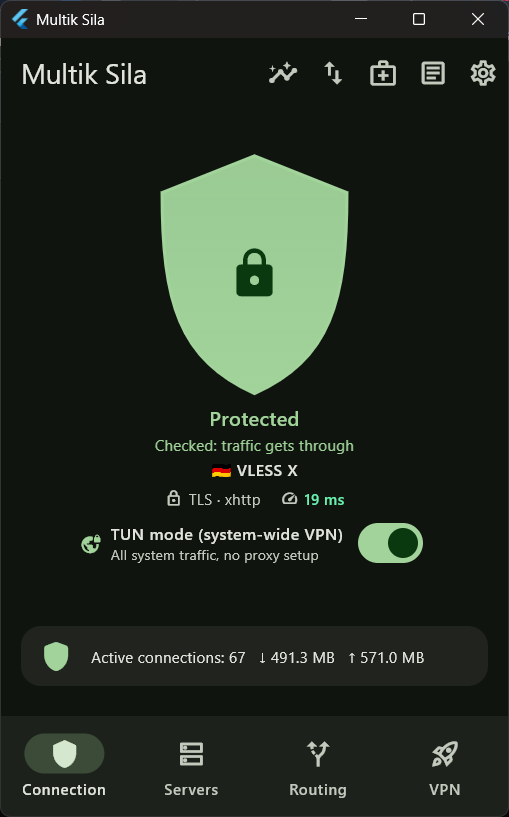
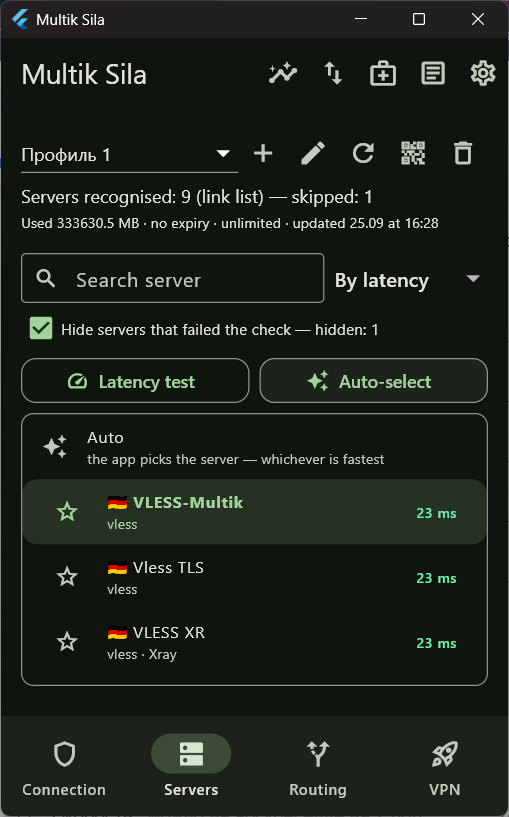
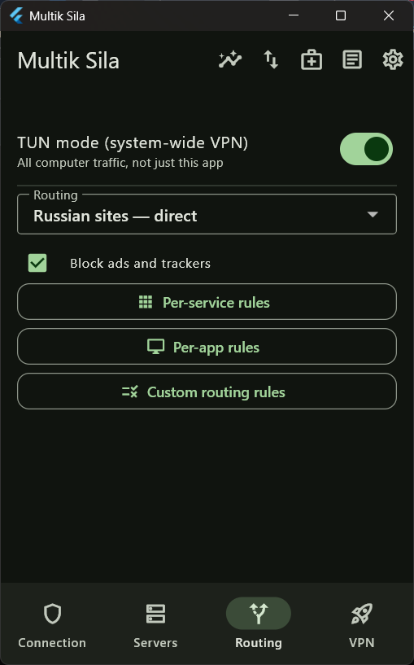
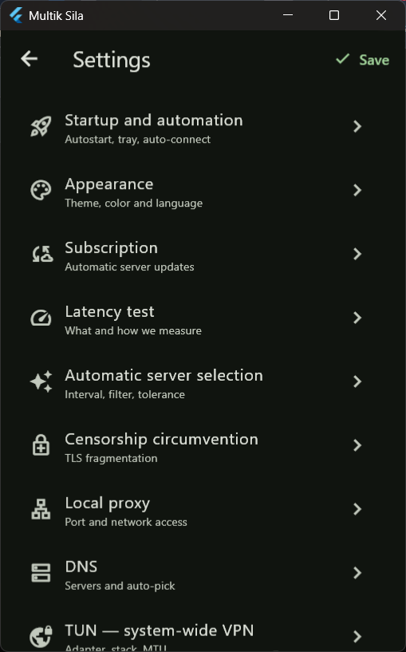

<p align="center">
  
</p>

<h1 align="center">Multik Sila</h1>

<p align="center">
  <b>A simple, powerful VPN client for Windows and Android</b><br>
  A <a href="https://github.com/SagerNet/sing-box">sing-box</a> and
  <a href="https://github.com/XTLS/Xray-core">Xray</a> GUI built with
  <a href="https://flutter.dev">Flutter</a>.
</p>

<p align="center">
  <b>English</b> | <a href="README_ru.md">Русский</a>
</p>

<p align="center">
  <a href="https://github.com/MrMultik/Multik-Sila/releases/latest"></a>
  <a href="https://github.com/MrMultik/Multik-Sila/releases"></a>
  <a href="https://github.com/MrMultik/Multik-Sila/stargazers"></a>
  <a href="https://github.com/MrMultik/Multik-Sila/issues"></a>
  <a href="https://github.com/MrMultik/Multik-Sila/commits/main"></a>
  
  <a href="LICENSE"></a>
</p>

<p align="center">
  <a href="https://github.com/MrMultik/Multik-Sila/releases/latest"></a>
  <a href="https://github.com/MrMultik/Multik-Sila/releases/latest"></a>
  <a href="https://t.me/Sila_Multik_bot"></a>
</p>

<p align="center">
  
  
  
  
</p>

---

## Download

Grab the files from the **[latest release](https://github.com/MrMultik/Multik-Sila/releases/latest)**.
Both engines are already inside — there is nothing else to download.

| Platform | File | Notes |
|---|---|---|
| **Windows** 10 / 11, 64-bit | `MultikSila-<version>-setup.exe` | Installs into your user profile. No administrator rights needed to install. |
| **Android** 7+ | `MultikSila-<version>-android-arm64-v8a.apk` | For any current phone. Not sure which one? Take this. |
| Android, older 32-bit phones | `MultikSila-<version>-android-armeabi-v7a.apk` | Only if the arm64 build refuses to install. |

The `-windows-x64.zip` in the release is **not** a portable build — it is what the
app downloads to update itself. Install from the `.exe`.

## Quick start

1. **Install** the app for your platform (see [Download](#download)).
2. **Get a subscription.** Our Telegram bot
   **[@Sila_Multik_bot](https://t.me/Sila_Multik_bot)** hands out subscriptions,
   renewals and support. Any other VLESS / VMess / Trojan / Hysteria2 subscription
   works too.
3. **Add it.** On first launch the setup wizard asks for it. Later you can add
   more from the **Servers** tab → **+**: paste a link, pick a file, paste the text
   itself, or scan a QR code.
4. **Connect.** Tap the shield on the main screen. By default the app picks the
   fastest server; tap any server in the list to choose it yourself, or **Auto** at
   the top to hand the choice back.

### Windows: regular mode or TUN?

- **Regular mode** sets a system proxy. Browsers and most messengers use it;
  games and some desktop programs ignore it and connect directly.
- **TUN mode** is a system-wide VPN: *everything* goes through the tunnel. Switch
  it on when a program refuses to use the proxy. It needs administrator rights —
  Windows asks once, and the app restarts itself with them.

On Android the tunnel is always system-wide, so there is nothing to choose.

## Features

- **Subscriptions** by link, file, pasted text or QR code, in any common format:
  plain link lists, **Clash YAML** and **sing-box JSON**. They refresh on their own.
- **Protocols:** VLESS (incl. REALITY and xhttp), VMess, Trojan, Hysteria2, Shadowsocks.
- **Choose the server yourself or let the app do it.** Auto mode measures every
  server and picks the fastest; manual mode keeps exactly the one you chose.
- **Split tunnelling:** Russian sites go direct, everything else through the VPN.
  Rule sets ship inside the app, so it works on the very first launch.
- **Custom rules** by domain, address, popular service or individual program.
- **Ad and tracker blocking.**
- **Self-healing connection:** a health check notices a server that stops passing
  traffic and moves off it; after sleep the app waits for the network instead of
  blaming the servers.
- **Engines that keep themselves up to date** (Windows): new sing-box and Xray
  releases are downloaded, verified against your configuration, and applied on
  the next start.
- **Statistics and diagnostics:** live speed, active connections, network
  interfaces and routes, and the exact configs handed to the engines.
- Country flags, light and dark themes, English and Russian interface.

## FAQ

<details>
<summary><b>Windows warns that the installer is from an unknown publisher.</b></summary>

The installer is not code-signed, so Windows SmartScreen does not recognise it
yet. Click **More info → Run anyway**. The files are built from this repository;
you can build them yourself — see [Building from source](#building-from-source).
</details>

<details>
<summary><b>Connected, but some program still goes around the VPN.</b></summary>

That program ignores the system proxy. Switch on **TUN mode** on the main screen —
it tunnels every program on the machine.
</details>

<details>
<summary><b>"Connected, but nothing gets out through it".</b></summary>

The server accepted the connection but traffic does not pass. Pick another server,
or tap **Auto** at the top of the server list and let the app choose.
</details>

<details>
<summary><b>Android: the VPN turned itself off.</b></summary>

Android keeps one VPN active at a time. Switching another VPN app on revokes ours;
the app notices and shows it as disconnected. Switch it back on when you need it.
</details>

<details>
<summary><b>Will an update wipe my subscriptions?</b></summary>

No. Profiles and settings are stored separately from the program and survive
updates and even an uninstall.
</details>

## Why two engines

sing-box provides native TUN support and does most of the work. It does not support
the `xhttp` transport, so servers using it are handled by Xray: in regular mode Xray
hosts the local proxy itself, and in TUN mode each such server gets its own bridge
while sing-box still does all the routing.

## Building from source

<details>
<summary><b>Windows</b></summary>

You need the Flutter SDK (stable channel) and Visual Studio with the
"Desktop development with C++" workload.

```
flutter pub get
flutter build windows --release
```

Engine executables are **not stored in this repository** — they are third-party
builds and weigh about 90 MB together. Place them next to the application `.exe`:

- `sing-box.exe` — [SagerNet/sing-box releases](https://github.com/SagerNet/sing-box/releases), the `windows-amd64` build;
- `xray.exe` — [XTLS/Xray-core releases](https://github.com/XTLS/Xray-core/releases), the `Xray-windows-64.zip` archive.

The installer needs [Inno Setup 6](https://jrsoftware.org/isdl.php):

```
ISCC.exe installer\multik_sila.iss
```

The result lands in `installer\output\`.
</details>

<details>
<summary><b>Android</b></summary>

The engine is a library here, so it is built first. `mobile\build_aar.ps1` needs the
Go toolchain and the Android NDK; it produces `silacore.aar` (sing-box plus an Xray
wrapper for `xhttp`). The `.aar` is not stored in the repository — it weighs about 55 MB.

```
powershell -File mobile\build_aar.ps1
flutter build apk --release --split-per-abi
```
</details>

## Acknowledgements

Multik Sila stands on [sing-box](https://github.com/SagerNet/sing-box) and
[Xray-core](https://github.com/XTLS/Xray-core) — independent projects with their own
licences.

## License

Multik Sila is free software, released under the [GNU General Public License v3.0](LICENSE).

The artwork in `docs/assets` is © MrMultik and is not covered by that licence —
please don't reuse it without permission.

<p align="center">
  <a href="https://t.me/Sila_Multik_bot"></a>
</p>
